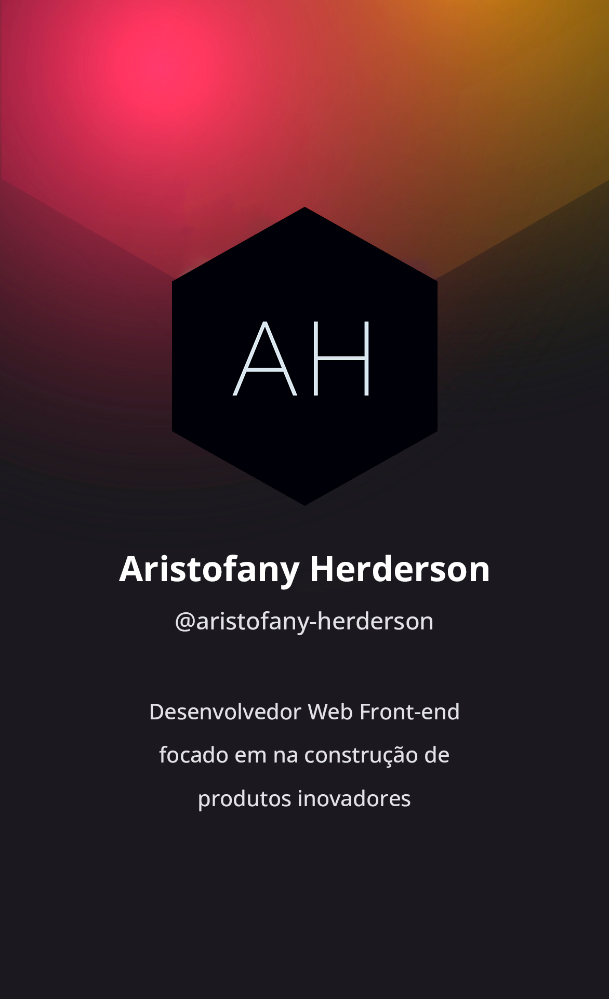

<h1 align="left">Olá, Eu sou Aristofany Herderson!</h1>

- 🔥 Desenvolvedor front-end, focado em tirar seus projetos do papel

- 🔭 Trabalho, atualmente, como freelancer

- 👨‍💻 Todos os meus projetos estão disponíveis no [Github](https://github.com/aristofany-herderson?tab=repositories)

- ▶️ Eu regurlamente posto conteúdo no [Instagram](https://instagram.com/aristofanyherderson/)

- 💬 Pergunte-me sobre **HTML, CSS, JavaScript, Typescript, React**

- ⚡ Fato divertido **Fascinado por tecnologia**

 

## 🛠️ &nbsp; Stack de Tecnologias

##### Front-End

##### Back-End

##### Versionamento

##### Documentação e Ferramental

 

## ⚙️ &nbsp; Análise do Github

  <h4>Estatísticas do Github</h4>
  

   

  <h4>Linguagens Mais Usadas</h4>
  

 

## 🧾 &nbsp; Entre em contato

  
  
  

